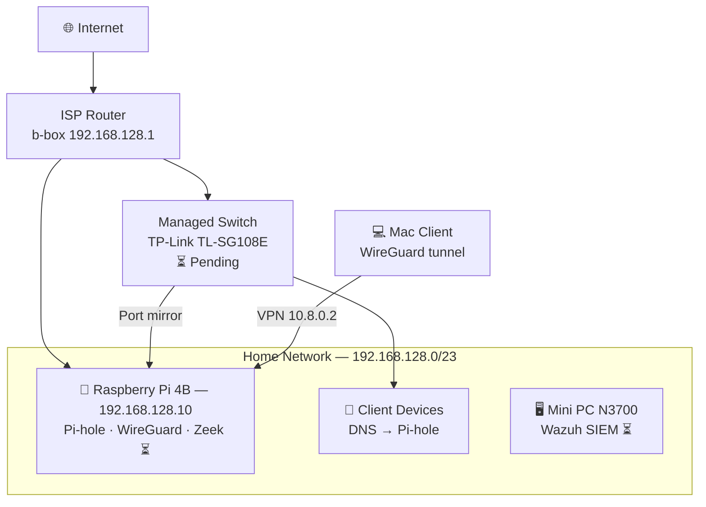

# 🏠 Home Cybersec Lab

A personal cybersecurity home lab built on a Raspberry Pi 4B (4GB), documenting the design, deployment, and rationale of layered network security controls. Built as a practical complement to CompTIA Security+ certification.

## Objectives

- Apply **defense-in-depth** principles on a real network
- Build hands-on experience with industry-standard open source security tooling
- Document threat detections and incident analysis
- Demonstrate operational security skills for AppSec / DevSecOps roles

---

## Architecture

---

## Stack

| Component | Role                        | Host  | Status              |
| --------- | --------------------------- | ----- | ------------------- |
| UFW       | Host-based firewall         | RPi   | ✅ Active           |
| Fail2ban  | Brute-force protection      | RPi   | ✅ Active           |
| Pi-hole   | DNS filtering / ad blocking | RPi   | ✅ Active           |
| WireGuard | VPN server                  | RPi   | ✅ Active           |
| Zeek      | Passive network IDS         | RPi   | ⏳ Pending switch   |
| Wazuh     | SIEM / EDR                  | N3700 | ⏳ Pending hardware |

---

## Security Controls Mapped to Frameworks

| Control               | CIS Control | NIST SP 800-53                      |
| --------------------- | ----------- | ----------------------------------- |
| UFW — default deny    | CIS 4.4     | SC-7 (Boundary Protection)          |
| Fail2ban              | CIS 4.3     | AC-7 (Unsuccessful Login Attempts)  |
| Pi-hole DNS filtering | CIS 9.2     | SC-20 (Secure Name Resolution)      |
| WireGuard VPN         | CIS 12.6    | SC-8 (Transmission Confidentiality) |
| Zeek IDS              | CIS 13.3    | SI-4 (System Monitoring)            |
| Wazuh SIEM            | CIS 8.11    | AU-6 (Audit Review)                 |

---

## Hardware

| Device            | Specs                             | Role                   |
| ----------------- | --------------------------------- | ---------------------- |
| Raspberry Pi 4B   | ARM Cortex-A72 · 4GB RAM          | Security services node |
| Mini PC N3700     | Intel N3700 · 8GB RAM · 128GB SSD | Wazuh SIEM node        |
| TP-Link TL-SG108E | 8-port managed switch             | Port mirroring for IDS |

---

## Setup Guides

- [01 — OS Hardening](./setup/01-os-hardening.md)
- [02 — Pi-hole](./setup/02-pihole.md)
- [03 — WireGuard](./setup/03-wireguard.md)
- [04 — Zeek](./setup/04-zeek.md) _(pending)_
- [05 — Wazuh](./setup/05-wazuh.md) _(pending)_

---

## Incident Reports

_To be populated as Zeek and Wazuh come online._

---

## Key Design Decisions

**Why two nodes instead of one?**
Separating the IDS/DNS/VPN layer (RPi) from the SIEM layer (N3700) avoids resource contention and mirrors a real-world architecture where log collection is decoupled from log analysis.

**Why WireGuard over OpenVPN?**
WireGuard's minimal codebase (~4,000 lines vs ~400,000 for OpenVPN) reduces attack surface and improves auditability. Performance on ARM is significantly better.

**Why Pi-hole for DNS?**
DNS-layer filtering stops threats before a TCP connection is established, requiring no per-device agent. All devices on the network are covered via DHCP DNS advertisement.

---

## Author

Senior Front-end Engineer pivoting to Application Security / DevSecOps.
Brussels, Belgium.
